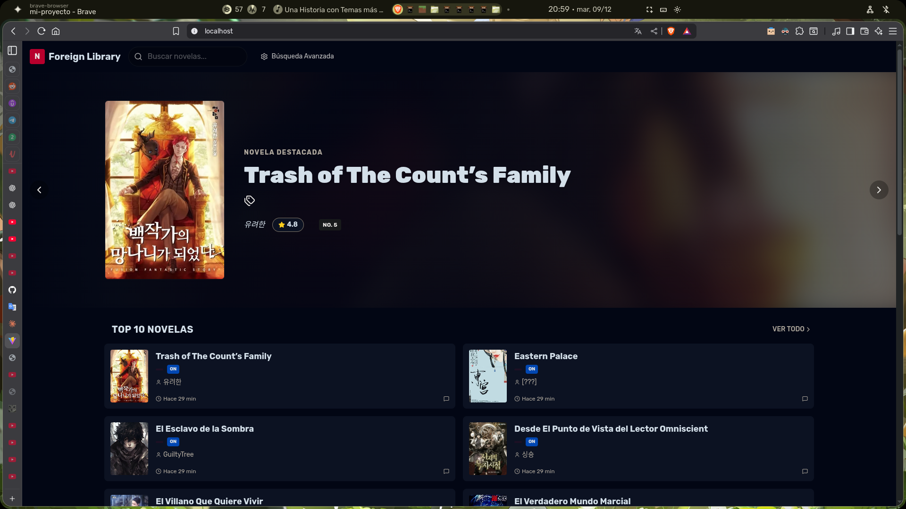

# 📚 Novels Portable - Sistema Completo de Gestión de Novelas

Sistema completo de gestión de novelas ligeras con scraping automático desde NovelasLigera.com, interfaz moderna y API REST robusta.

## Responsivo y Hermoso

<p align="center">
  
</p>
---

## 🎯 Características

- ✅ **Backend FastAPI** - API REST completa con autenticación JWT
- ✅ **Frontend React** - Interfaz moderna y responsiva
- ✅ **Base de datos MySQL** - Datos persistentes con SQLModel
- ✅ **Scraper integrado** - Descarga automática de novelas desde NovelasLigera.com
- ✅ **Docker Compose** - Deploy con un solo comando
- ✅ **Gestión de géneros** - Categorización y filtrado avanzado
- ✅ **Sistema de capítulos** - Almacenamiento y lectura estructurada

---

## 🚀 Inicio Rápido

### Requisitos Previos

- Docker (v20.10+)
- Docker Compose (v2.0+)
- 4GB RAM mínimo
- 10GB espacio en disco

### Instalación

```bash
# 1. Clonar o descomprimir el proyecto
cd novels-portable

# 2. Configurar variables de entorno
cp .env.example .env
# Editar .env y cambiar SECRET_KEY y passwords

# 3. Iniciar todos los servicios
docker-compose up -d

# 4. Ver logs en tiempo real
docker-compose logs -f

# 5. Esperar a que todo inicie (~60-90 segundos)
```

### Acceso

| Servicio          | URL                         | Descripción                      |
| ----------------- | --------------------------- | -------------------------------- |
| **Frontend**      | http://localhost            | Aplicación web                   |
| **API Docs**      | http://localhost:8000/docs  | Swagger UI                       |
| **ReDoc**         | http://localhost:8000/redoc | Documentación alternativa        |
| **Base de Datos** | localhost:3306              | MySQL (usa cliente como DBeaver) |

### Credenciales por Defecto

**Base de datos:**

- Usuario: `novels_user`
- Password: `novels_pass`
- Database: `novels_db`

⚠️ **IMPORTANTE:** Cambiar en producción

---

## 📊 Estructura del Proyecto

```
novels-portable/
├── docker-compose.yml          # Orquestador de contenedores
├── init.sql                    # Inicialización de la base de datos
├── README.md                   # Este archivo
│
├── backend/                    # API FastAPI
│   ├── Dockerfile
│   ├── main.py                # Punto de entrada
│   ├── requirements.txt
│   ├── pyrightconfig.json
│   │
│   ├── api/                   # Endpoints de la API
│   │   ├── admin.py          # Rutas de administración
│   │   ├── auth.py           # Autenticación y registro
│   │   ├── chapters.py       # Gestión de capítulos
│   │   ├── deps.py           # Dependencias compartidas
│   │   ├── genres.py         # Gestión de géneros
│   │   ├── novels.py         # CRUD de novelas
│   │   └── scraping.py       # API de scraping
│   │
│   ├── core/                  # Configuración central
│   │   ├── config.py         # Variables de entorno
│   │   ├── data_base.py      # Conexión a BD
│   │   └── security.py       # JWT y passwords
│   │
│   ├── models/                # Modelos SQLModel
│   │   ├── chapter.py        # Modelo de capítulos
│   │   ├── genre.py          # Modelo de géneros
│   │   ├── novel.py          # Modelo de novelas
│   │   ├── novel_genre.py    # Relación muchos a muchos
│   │   └── user.py           # Modelo de usuarios
│   │
│   ├── schemas/               # Schemas Pydantic
│   │   ├── chapter.py        # DTOs de capítulos
│   │   ├── genre.py          # DTOs de géneros
│   │   ├── novel.py          # DTOs de novelas
│   │   ├── scraping.py       # DTOs de scraping
│   │   ├── token.py          # DTOs de autenticación
│   │   └── user.py           # DTOs de usuarios
│   │
│   ├── services/              # Lógica de negocio
│   │   ├── auth_services.py
│   │   ├── chapter_services.py
│   │   ├── novel_service.py
│   │   └── scraping_services.py
│   │
│   ├── scrapers/              # Sistema de scraping
│   │   ├── definitivo.py     # Scraper principal
│   │   ├── test_metadata.py  # Verificar disponibilidad
│   │   ├── verify_json.py    # Validar JSON descargado
│   │   ├── enviar-a-la-api.py # Subir a la API
│   │   ├── send-to-api.py
│   │   ├── sentoapiv2.py
│   │   └── mis_novelas/      # JSONs descargados
│   │
│   ├── static/                # Archivos estáticos
│   │   └── novels/           # Portadas de novelas
│   │       ├── *.jpg
│   │       └── *.webp
│   │
│   └── utils/                 # Utilidades
│
└── frontend/                  # React App
    ├── Dockerfile
    ├── nginx.conf
    ├── package.json
    └── src/
```

---

## 🕷️ Sistema de Scraping

El sistema incluye un scraper completo para descargar novelas desde **NovelasLigera.com**.

### Flujo de Trabajo

1. **Verificar disponibilidad** → 2. **Descargar novela** → 3. **Validar JSON** → 4. **Enviar a API**

### Comandos del Scraper

#### 1️⃣ Verificar que la novela existe

```bash
cd backend/scrapers
python test_metadata.py el-tutorial-es-demasiado-dificil
```

**Salida esperada:**

```
✓ Novela encontrada
✓ Título: El Tutorial Es Demasiado Difícil
✓ Total de capítulos: 350
```

#### 2️⃣ Descargar novela completa

```bash
# Descargar novela completa
python definitivo.py el-villano-que-quiere-vivir

# Descargar capítulos específicos (1-50)
python definitivo.py el-villano-que-quiere-vivir --start 1 --end 50

# Especificar directorio de salida personalizado
python definitivo.py el-villano-que-quiere-vivir --output ./novelas/
```

**Resultado:** Se crea un archivo JSON en `mis_novelas/el-villano-que-quiere-vivir.json`

#### 3️⃣ Validar el JSON descargado

```bash
python verify_json.py mis_novelas/el-villano-que-quiere-vivir.json
```

**Salida esperada:**

```
✓ JSON válido
✓ Estructura correcta
✓ Capítulos: 350
✓ Metadata completa
```

#### 4️⃣ Enviar a la API

```bash
python enviar-a-la-api.py mis_novelas/eastern-palace.json
```

**Resultado:** La novela se sube automáticamente a la base de datos con todos sus capítulos.

### Ejemplos Prácticos

```bash
# Workflow completo para una novela nueva
cd backend/scrapers

# 1. Verificar
python test_metadata.py trash-of-the-counts-family

# 2. Descargar (primeros 100 capítulos)
python definitivo.py trash-of-the-counts-family --start 1 --end 100

# 3. Validar
python verify_json.py mis_novelas/trash-of-the-counts-family.json

# 4. Subir a la API
python enviar-a-la-api.py mis_novelas/trash-of-the-counts-family.json
```

### Novelas de Ejemplo Incluidas

El proyecto incluye varias novelas pre-descargadas en `backend/scrapers/mis_novelas/`:

- `a-will-eternal.json`
- `desde-el-punto-de-vista-del-lector-omniscient.json`
- `eastern-palace.json`
- `el-esclavo-de-la-sombra.json`
- `el-principe-demonio-va-a-la-academia.json`
- `el-verdadero-mundo-marcial.json`
- `el-villano-que-quiere-vivir.json`
- `trash-of-the-counts-family.json`

---

## 🛠️ Comandos Útiles

```bash
# Ver estado de los contenedores
docker-compose ps

# Ver logs de un servicio específico
docker-compose logs backend
docker-compose logs frontend
docker-compose logs db

# Logs en tiempo real
docker-compose logs -f backend

# Reiniciar un servicio
docker-compose restart backend

# Detener todo
docker-compose down

# Detener y eliminar volúmenes (¡CUIDADO! Borra la BD)
docker-compose down -v

# Reconstruir imágenes (después de cambios en código)
docker-compose build
docker-compose up -d

# Ejecutar comando en un contenedor
docker-compose exec backend python -m pip list
docker-compose exec backend bash
docker-compose exec db mysql -u root -p
```

---

## 🔧 Configuración

### Cambiar Puertos

Edita `.env`:

```bash
# Si el puerto 80 o 3306 están ocupados
FRONTEND_PORT=8080
DB_PORT=3307
BACKEND_PORT=8001
```

Luego:

```bash
docker-compose down
docker-compose up -d
```

### Cambiar Passwords

1. Editar `.env`
2. Reiniciar contenedores:

```bash
docker-compose down -v  # ⚠️ Borra datos
docker-compose up -d
```

### Acceder a la Base de Datos

```bash
# Desde línea de comandos
docker-compose exec db mysql -u novels_user -p
# Password: novels_pass

# Desde herramienta gráfica (DBeaver, MySQL Workbench)
Host: localhost
Port: 3306
User: novels_user
Password: novels_pass
Database: novels_db
```

---

## 📦 Backup y Restauración

### Crear Backup

```bash
# Backup de la base de datos
docker-compose exec db mysqldump -u root -prootpassword novels_db > backup-$(date +%Y%m%d).sql

# Comprimir
gzip backup-$(date +%Y%m%d).sql

# Backup de imágenes
docker-compose exec backend tar -czf /tmp/static-backup.tar.gz static/
docker cp novels-backend:/tmp/static-backup.tar.gz ./static-backup.tar.gz
```

### Restaurar Backup

```bash
# Restaurar base de datos
docker-compose exec -T db mysql -u root -prootpassword novels_db < backup-20240115.sql

# Restaurar imágenes
docker cp static-backup.tar.gz novels-backend:/tmp/
docker-compose exec backend tar -xzf /tmp/static-backup.tar.gz -C /app/
```

---

## 🐛 Solución de Problemas

### Error: Puerto en uso

```bash
# Cambiar puerto en .env
FRONTEND_PORT=8080

# O detener el servicio que lo está usando
sudo lsof -i :80
sudo kill -9 PID
```

### Error: No se puede conectar a la BD

```bash
# Verificar que el contenedor esté corriendo
docker-compose ps

# Ver logs
docker-compose logs db

# Reiniciar contenedor
docker-compose restart db

# Esperar a que esté healthy
docker-compose ps  # Debe mostrar "healthy"
```

### Error: Frontend muestra página en blanco

```bash
# Verificar logs
docker-compose logs frontend

# Reconstruir
docker-compose build frontend
docker-compose up -d frontend

# Limpiar caché del navegador
Ctrl + Shift + R (Chrome/Firefox)
```

### Error: Scraper no descarga

```bash
# Verificar conexión a NovelasLigera.com
curl -I https://novelasligera.com/

# Verificar permisos de escritura
ls -la backend/scrapers/mis_novelas/

# Ver logs detallados del scraper
python definitivo.py nombre-novela --verbose
```

---

## 📈 Monitoreo

### Ver uso de recursos

```bash
# CPU y memoria
docker stats

# Espacio en disco de volúmenes
docker system df -v
```

---

## 🚀 Deploy en Producción

### 1. Cambiar configuración

```bash
# .env
DEBUG=false
SECRET_KEY=$(openssl rand -hex 32)
DB_PASSWORD=$(openssl rand -base64 32)
JWT_SECRET_KEY=$(openssl rand -hex 32)
```

### 2. Usar Nginx como reverse proxy

```nginx
# /etc/nginx/sites-available/novels
server {
    listen 80;
    server_name tu-dominio.com;

    location / {
        proxy_pass http://localhost:80;
        proxy_set_header Host $host;
        proxy_set_header X-Real-IP $remote_addr;
        proxy_set_header X-Forwarded-For $proxy_add_x_forwarded_for;
    }

    location /api {
        proxy_pass http://localhost:8000;
        proxy_set_header Host $host;
        proxy_set_header X-Real-IP $remote_addr;
    }
}
```

### 3. Configurar SSL con Let's Encrypt

```bash
sudo certbot --nginx -d tu-dominio.com
```

---

## 🛡️ API Endpoints

### Autenticación

- `POST /api/auth/register` - Registrar usuario
- `POST /api/auth/login` - Login (retorna JWT)

### Novelas

- `GET /api/novels` - Listar todas las novelas
- `GET /api/novels/{id}` - Obtener novela por ID
- `POST /api/novels` - Crear nueva novela
- `PUT /api/novels/{id}` - Actualizar novela
- `DELETE /api/novels/{id}` - Eliminar novela

### Capítulos

- `GET /api/chapters/novel/{novel_id}` - Capítulos de una novela
- `GET /api/chapters/{id}` - Obtener capítulo específico
- `POST /api/chapters` - Crear capítulo

### Géneros

- `GET /api/genres` - Listar géneros
- `POST /api/genres` - Crear género

### Scraping

- `POST /api/scraping/novel` - Iniciar scraping de novela

**Ver documentación completa:** http://localhost:8000/docs

---

## 🛠️ Tecnologías Utilizadas

### Backend

- **FastAPI** - Framework web moderno
- **SQLModel** - ORM con tipado
- **MySQL** - Base de datos relacional
- **Pydantic** - Validación de datos
- **JWT** - Autenticación segura
- **BeautifulSoup4** - Web scraping
- **httpx** - Cliente HTTP asíncrono

### Frontend

- **React** - Biblioteca UI
- **Nginx** - Servidor web
- **Docker** - Contenedores

---

## 📞 Soporte

- **Issues:** Reportar en el repositorio
- **Documentación API:** http://localhost:8000/docs
- **Email:** soporte@ejemplo.com

---

## 📄 Licencia

MIT License - Ver archivo LICENSE

---

## 🙏 Créditos

- FastAPI - https://fastapi.tiangolo.com/
- React - https://react.dev/
- NovelasLigera.com - Fuente de contenido
- Docker - https://www.docker.com/

---

**Versión:** 1.0.0  
**Última actualización:** Diciembre 2025  
**Autor:** Hernando Guzmán
